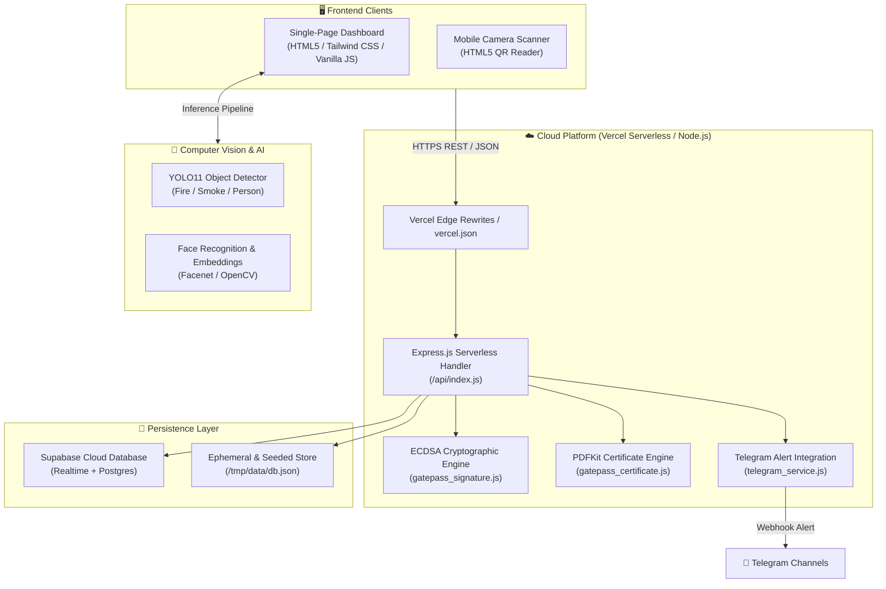

<div align="center">

# 🏢 HostelFix
### Next-Gen Smart Hostel Operations & AI Surveillance Platform

[](https://github.com/bala143118/hostel01/actions)
[](https://vercel.com)
[](https://nodejs.org)
[](https://expressjs.com)
[](https://supabase.com)
[](https://tailwindcss.com)
[](https://opensource.org/licenses/MIT)

<p align="center">
  <strong>An enterprise-grade smart residence management suite combining Computer Vision AI surveillance, ECDSA cryptographic gate pass authorization, real-time alerts, and automated facility maintenance.</strong>
</p>

[Explore Features](#-core-features) • [System Architecture](#-system-architecture) • [Demo Accounts](#-quick-demo-accounts) • [Deploy to Vercel](#-deployment-guide) • [API Documentation](#-api-endpoints-reference)

---

</div>

## 🌟 Executive Summary

**HostelFix** is an end-to-end full-stack platform built to modernize student residential facilities. It replaces legacy paper logbooks and fragmented chat groups with an intelligent ecosystem powered by:
- **Computer Vision (YOLO11 & Face Embeddings)** for automated fire/smoke detection, crowd density tracking, and curfew perimeter security.
- **Asymmetric Cryptography (ECDSA P-256 & JWT)** for tamper-proof digital gate pass issuance and verifiable PDF certificates.
- **Real-Time Communications** via Supabase real-time sync, WebSockets, and instant Telegram Bot push alerts.
- **Modular Role-Based Access Control (RBAC)** providing dedicated interfaces for **Students**, **Wardens**, **Technicians**, and **Admins**.

---

## ⚡ Core Features

### 1. 🔏 Cryptographic Gate Pass & Verifiable Certificates
- **ECDSA P-256 Digital Signatures**: Every approved gate pass is digitally signed using elliptic-curve cryptography, preventing tampering with student names, destination dates, or room numbers.
- **Dynamic Secure QR Codes**: Issues short-lived, encrypted JWT tokens in QR format for gate guards to scan on mobile or desktop cameras.
- **PDF Certificate Generation**: Generates high-resolution, branded PDF leave certificates with embedded cryptographic verification fingerprints.
- **Independent Verification Endpoint**: Dedicated `/api/gatepass/verify/:id` and `/qr/:token` endpoints allowing offline and external validity checks.

### 2. 🛡️ AI Smart Surveillance & Emergency Response
- **Fire & Smoke Hazard Detection**: Vision AI models continuously evaluate live CCTV streams or video uploads with adjustable confidence thresholds.
- **Restricted-Hours Night Curfew Enforcement**: Detects unauthorized student movements during curfew hours with automatic facial identification.
- **Telegram Bot Emergency Dispatch**: Instantly transmits emergency photo evidence and location data to warden emergency channels within seconds.
- **Automated Incident Logging**: Saves authenticated security snapshots and generates printable audit PDF detection reports.

### 3. 🛠️ Maintenance & Smart Facility Automation
- **Complaint Lifecycle Management**: Students report room or campus defects (Electrical, Plumbing, Furniture, WiFi) with priority tags; wardens assign technicians and track resolution status in real time.
- **Smart Laundry Machine Reservation**: Prevents laundry room overcrowding with slot scheduling and machine availability counters.
- **Live Broadcast Announcements**: Instant priority-coded notifications pushed across all student panels simultaneously.

---

## 🏗️ System Architecture



---

## 🔑 Quick Demo Accounts

Test the platform instantly using these pre-configured demo credentials:

| Role | Email | Password | Access Capabilities |
| :--- | :--- | :--- | :--- |
| **Student** | `student@hostelfix.edu` | `student123` | Apply for Gate Passes, File Room Complaints, Book Laundry |
| **Warden** | `warden@hostelfix.edu` | `warden123` | Approve Gate Passes, Verify QR at Gates, Night Curfew Alerts |
| **Admin** | `admin@hostelfix.edu` | `admin123` | Full Campus Dashboard, CCTV Surveillance, User Management |
| **Technician** | `tech@hostelfix.edu` | `tech123` | View & Resolve Assigned Maintenance Tasks |

---

## 🚀 Deployment Guide

### Option 1: Deploy to Vercel (Recommended)

HostelFix is optimized with zero-config serverless function adapters for **Vercel**:

1. **Fork or Clone this repository**:
   ```bash
   git clone https://github.com/bala143118/hostel01.git
   cd hostel01
   ```
2. **Push to your GitHub repository**:
   ```bash
   git push origin main
   ```
3. Import the project on [Vercel Dashboard](https://vercel.com/new).
4. Configure **Environment Variables** in Vercel settings:
   ```env
   SUPABASE_URL=https://your-project.supabase.co
   SUPABASE_SERVICE_ROLE_KEY=your-supabase-service-role-key
   TELEGRAM_BOT_TOKEN=your-telegram-bot-token        # Optional
   TELEGRAM_CHAT_ID=your-telegram-chat-id            # Optional
   GATEPASS_JWT_SECRET=your-secure-jwt-secret        # Optional
   ```
5. Click **Deploy**. Your application is instantly live worldwide!

---

### Option 2: Local Development Setup

```bash
# 1. Clone the repository
git clone https://github.com/bala143118/hostel01.git
cd hostel01

# 2. Install Node.js dependencies
npm install

# 3. Configure environment variables
cp .env.example .env

# 4. Start development server
npm start
```
Visit `http://localhost:5000` in your web browser.

---

## 🧪 Automated Testing & CI/CD

HostelFix features an automated integration and serverless test suite that runs on every commit via **GitHub Actions**:

```bash
# Run test suite locally
npm test
```

### Test Coverage Highlights:
- ✅ **Serverless Execution**: Ephemeral port binding and dynamic `/tmp` storage validation.
- ✅ **Cryptographic Tamper Detection**: Validates ECDSA P-256 signature verification and tamper rejection.
- ✅ **PDF Certificate Compilation**: Validates vector PDF byte buffers and formatting.
- ✅ **Complete REST Endpoints**: Validates complaints, gate passes, users, announcements, and laundry bookings.

---

## 📡 API Endpoints Reference

### Gate Pass & Cryptography
| Method | Endpoint | Description |
| :--- | :--- | :--- |
| `POST` | `/api/gate-passes` | Submit a new student gate pass application |
| `GET` | `/api/gate-passes` | Retrieve gate pass list (filterable by user) |
| `GET` | `/api/gate-passes/:id/pdf` | Generate and download signed PDF Certificate |
| `GET` | `/api/gatepass/verify/:id` | Verify cryptographic ECDSA digital signature |
| `GET` | `/api/gatepass/public-key` | Export ECDSA public key in standard PEM format |
| `GET` | `/qr/:token` | Web verification portal for security gate scanners |

### Maintenance & Operations
| Method | Endpoint | Description |
| :--- | :--- | :--- |
| `GET` | `/api/complaints` | List all hostel maintenance tickets |
| `POST` | `/api/complaints` | Create a new maintenance issue |
| `PUT` | `/api/complaints/:id/status` | Update complaint resolution status |
| `POST` | `/api/laundry-requests` | Book a smart laundry washing slot |
| `GET` | `/api/announcements` | Retrieve live priority announcements |

### AI Surveillance & Telemetry
| Method | Endpoint | Description |
| :--- | :--- | :--- |
| `POST` | `/api/cctv-inference` | Run real-time Fire/Smoke inference on frame |
| `POST` | `/api/send-telegram-alert` | Dispatch emergency incident snapshot to Telegram |
| `GET` | `/api/summary` | Retrieve high-level campus dashboard metrics |

---

## 💻 Tech Stack

- **Frontend**: Vanilla JavaScript (ES6+), HTML5, Tailwind CSS, FontAwesome 6, HTML5-QRCode
- **Backend**: Node.js, Express.js (Serverless Architecture on Vercel)
- **Database & Cloud**: Supabase (PostgreSQL), RESTful API
- **Cryptography & Security**: Node.js `crypto` (ECDSA P-256, SHA-256), JSON Web Tokens (`jsonwebtoken`)
- **Document Engine**: PDFKit
- **Computer Vision & AI**: Python 3, YOLO11, OpenCV, Facenet PyTorch

---

## 📄 License

This project is licensed under the **MIT License** - see the [LICENSE](LICENSE) file for details.

---

<div align="center">
  <sub>Built with ❤️ by <a href="https://github.com/bala143118">Balamurugan S</a></sub>
</div>
